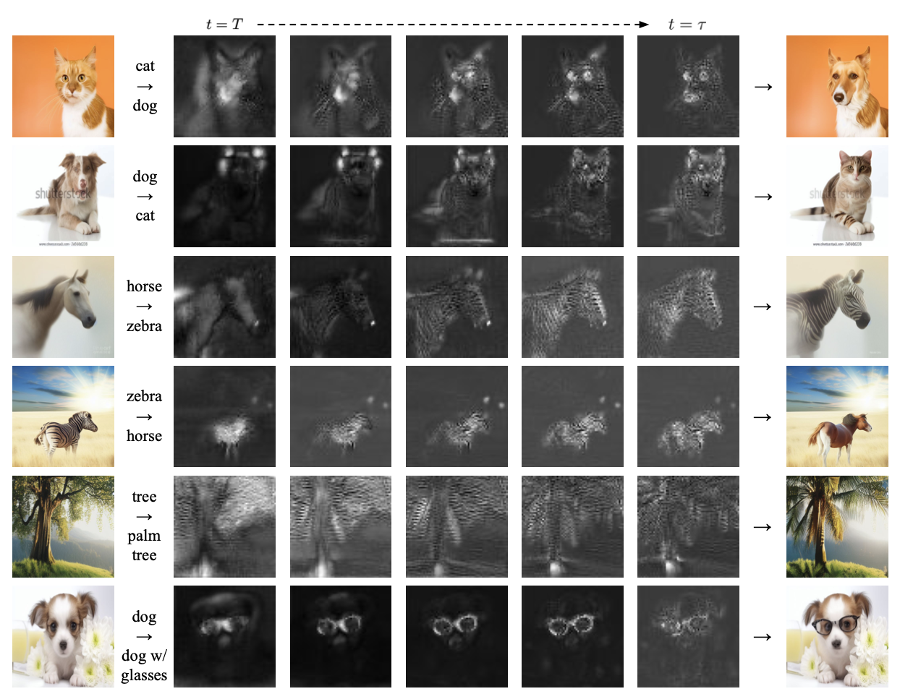

# Diffusion-based Image-to-Image Translation by Noise Correction via Prompt Interpolation (ECCV 2024 Poster) 

*Sorry for working in progress! We should add some details for our code.

This is the official code of the paper "Diffusion-based Image-to-Image Translation by Noise Correction via Prompt Interpolation" in ECCV 2024. 



## News

:star: [2024. July] Our paper is accepted in ECCV 2024! \
:star: [2024. Sep] We've uploaded our video & poster for ECCV 2024! You can check them through this [link](https://eccv.ecva.net/virtual/2024/poster/2134). Also, the official code of our paper has been released! We are still updating the code for better performance.


## Getting Started

### Installing


```
git clone https://github.com/JS-Lee525/PIC.git
```

```
conda create -n [your_env] python=3.9
pip install -r requirements.txt
```


### Execution

```
sh inference_single.sh 
```

## Citation 
```
@article{lee2024diffusion,
  title={Diffusion-Based Image-to-Image Translation by Noise Correction via Prompt Interpolation},
  author={Lee, Junsung and Kang, Minsoo and Han, Bohyung},
  journal={arXiv preprint arXiv:2409.08077},
  year={2024}
}
```
## License

This project is licensed under the MIT License.
